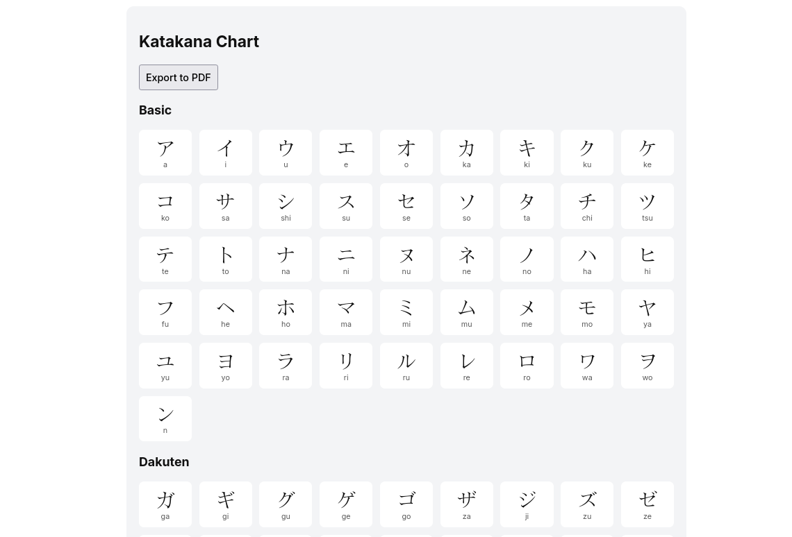

# Japanese Kana Quiz 🈶

A fast, minimal, and fully client-side **Japanese Kana learning web app** focused on **Hiragana and Katakana**.

This project is designed to be **stateless**, **lightweight**, and **offline-friendly**.

---

---
## ✨ Features

### 🧠 Quiz System
- Practice **Hiragana**, **Katakana**, or both
- Select quiz types:
  - **Basic (46 characters)**
  - **Dakuten / Handakuten**
  - **Yōon (combined sounds like kya, gya, etc.)**
- Live **count preview** based on selected options
- Randomized quiz order
- Keyboard-only input (press `Enter` to submit)
- Input feedback using **green / red flashes** (no distracting text)
- **Progress bar** during quiz
- Supports retrying **only wrong answers**

---

### 📊 Result & Analytics
- Total questions attempted
- Total correct answers
- Overall accuracy (%)
- **Accuracy per type**:
  - Basic
  - Dakuten / Handakuten
  - Yōon
- Visual **wrong answer preview grid**
- Restart quiz or retry wrong answers only

---

### 📚 Kana Charts
- Separate charts for:
  - Hiragana
  - Katakana
- Each chart includes:
  - Basic
  - Dakuten
  - Handakuten
  - Yōon
- Clean, readable grid layout
- **Export charts to PDF** (via browser print → Save as PDF)

---

Everything runs entirely in the browser.

---
| Built with ❤️ for Japanese learners who want a simple, fast, and effective way to master kana